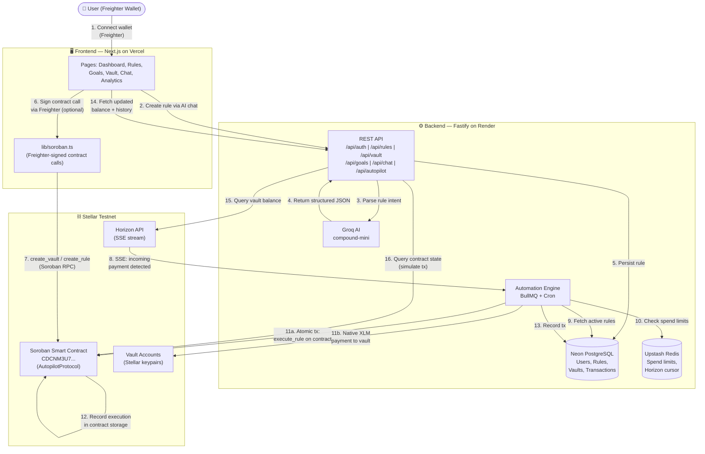
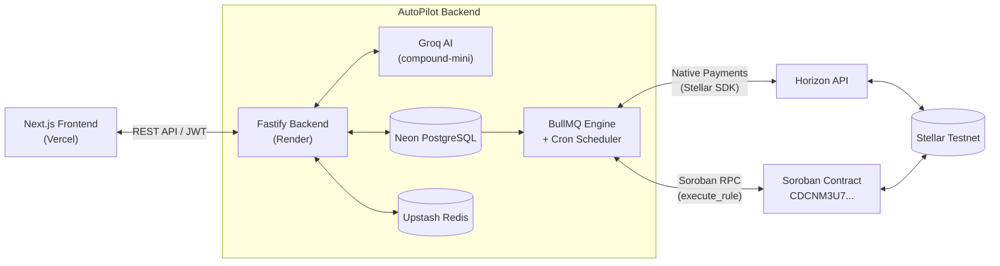
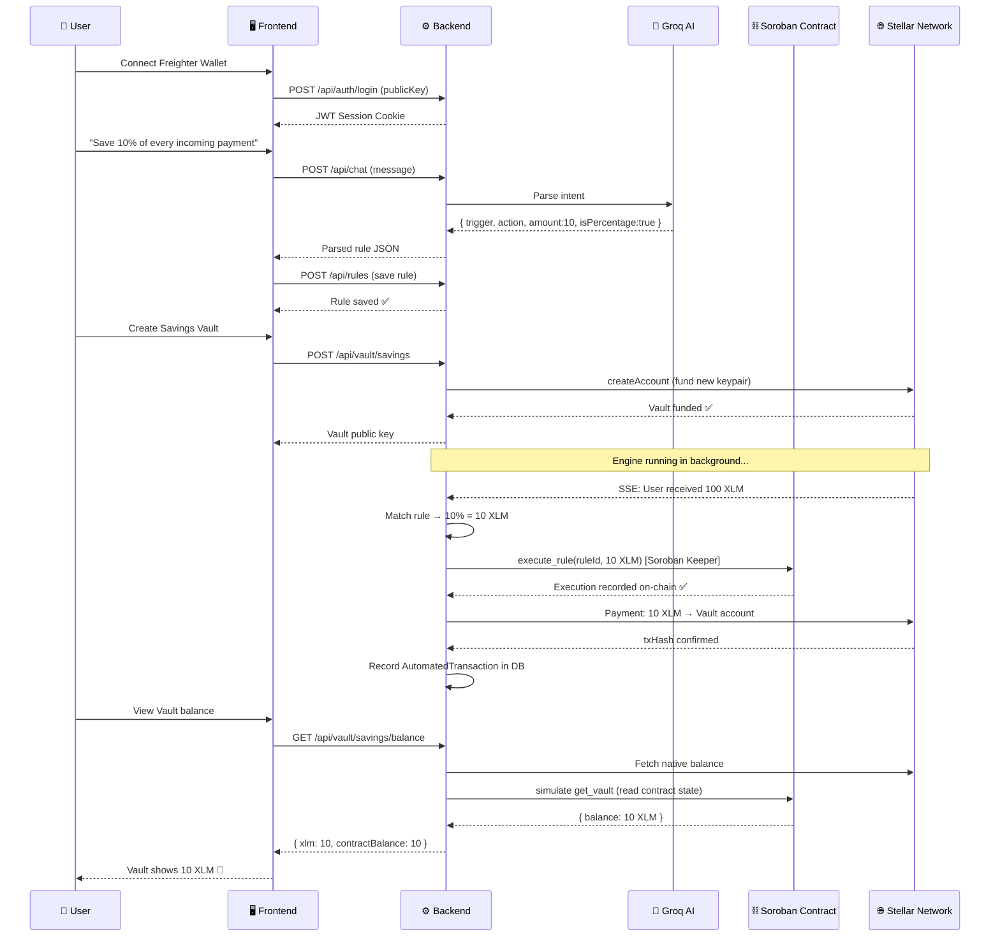

<div align="center">
  
  <h1>AutoPilot</h1>
  <p><strong>AI-Powered Financial Automation on the Stellar Network</strong></p>
  <p><em>Describe a financial rule in plain English. AutoPilot executes it on-chain — forever.</em></p>

  <p>
    
    
    
    
    
    
    
  </p>
</div>

---

## 🔗 Important Links

* **Live Deployment:** [https://autopilot-stellar-mauve.vercel.app](https://autopilot-stellar-mauve.vercel.app) *(Live AutoPilot Application on Vercel)*
* **GitHub Repository:** [https://github.com/TAPABRATA/Autopilot](https://github.com/TAPABRATA/Autopilot)
* **Demo Video:** [Watch the AutoPilot MVP Demo](https://youtu.be/OG6kS41sLGg)

---

## 💡 The Problem & Solution

### The Problem
Managing personal finances — specifically consistently saving and investing — is a manual, emotional, and often forgotten task. Traditional banking apps offer basic "auto-transfers" but lack dynamic intelligence (e.g., *"Save 10% only if I receive a payment over $50"*).

### The Solution
**AutoPilot** bridges natural language AI with the speed and low cost of the Stellar blockchain. Users simply tell the AI what they want to do, and the AutoPilot engine constantly monitors their Stellar wallet, executing those rules autonomously and instantly — with every execution verified on a live **Soroban smart contract**.

### Real-World Application
Imagine a freelancer who gets paid sporadically in XLM on Stellar. Instead of manually moving money to savings every time they get paid, AutoPilot automatically calculates 15% of that specific payment, calls the Soroban contract to record the execution on-chain, and instantly sweeps the funds into a secure, encrypted "Vault" account on the blockchain.

### Revenue Generation (Business Model)
* **Freemium Model:** Users get 2 active rules for free.
* **Pro Tier:** Subscription fee (e.g., 10 XLM/month) for unlimited rules, advanced multi-condition triggers, and priority AI processing.
* **Volume Fees:** A micro-fee (e.g., 0.01 XLM) charged on automated investment routing.

---

## 📝 User Feedback & Survey

As part of our continuous improvement, we collected feedback from early beta testers. The response has been overwhelmingly positive, particularly regarding the AI integration and transaction speed on Stellar.

* **Google Form Link:** [Submit Feedback](https://forms.gle/qbYARHgyDLPHLUEE9)

## 📸 Application Screenshots

### 1. Onboarding Screen

*A seamless Web3 onboarding experience allowing users to connect their Freighter wallet to access the AutoPilot dashboard.*

### 2. Main Dashboard

*The central hub where users can track their total automated wealth, view active automation rules, and monitor recent on-chain activity.*

### 3. AI Financial Coach

*Users can chat with the AI to generate financial insights and automatically construct complex savings rules in plain English.*

### 4. Chat Interface

*An intuitive, natural language interface powered by Groq and compound-mini, enabling conversational automation rule creation.*

### 5. Automation Rules

*The control center for all active financial triggers. Users can view, pause, and delete their automated savings or investment logic.*

### 6. Goal Tracking

*Set financial milestones (e.g., Vacation, Emergency Fund) and link them to automation rules to track real-time progress.*

### 7. On-Chain Vaults

*Server-controlled Stellar accounts mapped to the user. Funds are autonomously routed here when rules execute, ready for withdrawal.*

### 8. Account Settings & Limits

*Manage spending limits, view full transaction history, and configure premium features to ensure safe and responsible automation.*

### 9. Mobile Onboarding Screen

*An optimized mobile view of the wallet connection screen, designed to fit smaller layouts perfectly.*

### 10. Mobile Dashboard

*The fully responsive mobile dashboard showing wallet balance, active rules, and recent actions on a single column layout.*

### 11. Analytics & Monitoring

*Vercel Analytics integrated directly into the application to monitor real-time traffic, web vitals, and user engagement.*

---

## 🛠️ Tech Stack

| Layer | Technology | Role |
| :--- | :--- | :--- |
| **Frontend** | Next.js 14 (App Router), Tailwind CSS, Framer Motion | Responsive UI, wallet connection, rule management, vault dashboard |
| **Backend** | Fastify (Node.js), TypeScript | REST API, JWT auth, AI orchestration, automation engine |
| **Database** | Neon (PostgreSQL) | User profiles, encrypted vault keys, rule logic, transaction history |
| **Smart Contracts** | Soroban (Rust) on Stellar Testnet | On-chain rule registry, vault tracking, keeper execution |
| **AI Engine** | Groq (compound-mini) | Natural language → structured JSON rule parsing |
| **Queue / Cache** | BullMQ + Upstash Redis | Async job processing, spending limit tracking, Horizon cursor state |
| **Blockchain SDK** | @stellar/stellar-sdk, Horizon API | Native payments, account creation, USDC trustlines, Soroban RPC calls |
| **Security** | AES-256-GCM, JWT HttpOnly cookies | Vault private key encryption, session management |

---

## 📂 Project Structure

```text
autopilot/
├── contracts/                          # Soroban Smart Contracts (Rust)
│   ├── src/
│   │   ├── lib.rs                      # Crate root
│   │   ├── registry.rs                 # AutopilotProtocol contract (main entry)
│   │   ├── types.rs                    # Vault, AutomationRule, DataKey types
│   │   ├── registry/                   # Registry sub-modules
│   │   ├── rules/                      # Rule execution sub-modules
│   │   └── vault/                      # Vault state sub-modules
│   ├── Cargo.toml                      # Soroban SDK dependency
│   └── Makefile                        # `stellar contract build` shortcut
│
├── backend/                            # Fastify API Server (Node.js / TypeScript)
│   └── src/
│       ├── engine/
│       │   ├── index.ts                # Engine entry — starts Horizon stream + scheduler
│       │   ├── horizonStream.ts        # SSE stream listener for incoming payments
│       │   ├── processor.ts           # BullMQ payment job processor (Soroban keeper)
│       │   ├── scheduler.ts           # Cron fallback scheduler
│       │   ├── queue.ts               # BullMQ queue definitions
│       │   └── limitGuard.ts          # Daily/weekly spending limit enforcement via Redis
│       ├── lib/
│       │   ├── db.ts                  # Neon PostgreSQL connection
│       │   ├── engine.ts              # executeRuleTransaction helper
│       │   └── redis.ts               # Upstash Redis client
│       ├── middleware/
│       │   └── auth.ts                # JWT verification middleware
│       ├── migrations/                # SQL migration scripts
│       ├── routes/
│       │   ├── auth.ts                # POST /api/auth/login|logout
│       │   ├── rules.ts               # CRUD /api/rules
│       │   ├── goals.ts               # CRUD /api/goals
│       │   ├── chat.ts                # POST /api/chat (Groq AI)
│       │   ├── vault.ts               # Vault lifecycle /api/vault
│       │   ├── account.ts             # Account settings /api/account
│       │   ├── autopilot.ts           # Engine status & monitor /api/autopilot
│       │   └── transactions.ts        # Transaction history /api/transactions
│       ├── scripts/                   # Dev scripts (friendbot, e2e, simulate)
│       ├── stellar/
│       │   ├── horizon.ts             # Horizon API helpers (balances, payments)
│       │   ├── transaction.ts         # Native XLM/USDC transaction builders
│       │   ├── vault.ts               # Vault creation, deposit, withdraw, close
│       │   ├── soroban.ts             # ⭐ Soroban RPC keeper — calls execute_rule on-chain
│       │   ├── keypair.ts             # AES-256-GCM vault key encryption/decryption
│       │   └── dex.ts                 # DEX swap (DCA) helpers
│       └── server.ts                  # Fastify server entry point
│
└── frontend/                           # Next.js 14 Application
    └── src/
        ├── app/
        │   ├── page.tsx               # Landing page
        │   ├── layout.tsx             # Root layout
        │   ├── onboarding/            # Freighter wallet connect flow
        │   ├── dashboard/             # Main dashboard
        │   ├── chat/                  # AI coach chat UI
        │   ├── rules/                 # Rule management UI
        │   ├── goals/                 # Goal tracking UI
        │   ├── vault/                 # Vault UI (create, withdraw)
        │   ├── account/               # Account settings UI
        │   └── analytics/             # Analytics page
        ├── components/
        │   ├── Sidebar.tsx            # Navigation sidebar (desktop + mobile)
        │   ├── DashboardShell.tsx     # Layout wrapper for auth pages
        │   └── EngineStatusPanel.tsx  # Live engine status widget
        └── lib/
            ├── session.ts             # JWT session helpers
            ├── soroban.ts             # ⭐ Client-side Soroban helpers (Freighter-signed calls)
            └── [api route helpers]    # API fetch wrappers per feature
```

---

## 🏗️ Full-Stack Architecture

AutoPilot is a **true three-tier full-stack** application where the frontend, backend, and on-chain contracts are all actively integrated and communicating:



---

## 🔗 Full-Stack Integration Deep Dive

This section explains exactly how the **frontend**, **backend**, and **Soroban contracts** are wired together end-to-end.

### 1. Frontend ↔ Backend

The Next.js frontend communicates with the Fastify backend exclusively over a **REST API secured with JWT HttpOnly cookies**.

**Authentication Flow:**
1. User connects their Freighter wallet on the `/onboarding` page.
2. Freighter signs a challenge nonce; the frontend POSTs the public key to `POST /api/auth/login`.
3. The backend issues a JWT stored as an HttpOnly cookie — no private key ever leaves the browser.
4. All subsequent API calls include the cookie, verified by the `verifyAuth` middleware on every protected route.

**Data Flow for Rule Creation:**
1. User types `"Save 15% of every incoming payment"` in the Chat UI.
2. Frontend POSTs to `POST /api/chat` with the message.
3. Backend calls Groq AI, which parses the intent into structured JSON: `{ trigger, action, amount, isPercentage }`.
4. Frontend receives the parsed rule and POSTs to `POST /api/rules` to persist it.
5. The rule is now active in PostgreSQL and watched by the engine.

### 2. Backend ↔ Soroban Contract (Keeper Pattern)

The backend acts as an **off-chain Keeper** for the deployed Soroban contract (`CDCNM3U73F3OK34CCTTCKLWDDLJOBG24VTOPXT3IVNVOCNHAVL4WSE4X`). When a payment is detected:

1. **`backend/src/stellar/soroban.ts`** constructs a Soroban transaction using `@stellar/stellar-sdk`.
2. The transaction includes TWO atomic operations:
   - `contract.call("execute_rule", ruleId, paymentAmount)` — records the execution in the contract's persistent storage.
   - `Operation.payment(destination: vaultPublicKey, amount)` — moves the actual XLM to the user's vault.
3. The transaction is prepared via `SorobanRpc.Server.prepareTransaction()` (handles fee simulation and footprint).
4. Signed with the backend Engine keypair and submitted via `server.sendTransaction()`.
5. The real **on-chain transaction hash** is returned and stored in PostgreSQL.

If the Soroban RPC is unreachable, the engine automatically falls back to a native Stellar payment to ensure no funds are lost.

### 3. Frontend ↔ Soroban Contract (Direct Wallet Signing)

For actions that require **user authorization** (not the backend Engine), the frontend can call the contract directly using the user's Freighter wallet:

**File:** `frontend/src/lib/soroban.ts`

```typescript
// Creates a vault entry directly in the Soroban contract, signed by the user's Freighter wallet
export async function createVaultOnContract(userPublicKey: string): Promise<boolean>
```

**Flow:**
1. Frontend builds a Soroban transaction (`contract.call("create_vault", ownerVal)`).
2. Calls `server.prepareTransaction()` against Soroban RPC to get fee estimates and simulation.
3. Calls `signTransaction(preparedTx.toXDR(), { networkPassphrase })` — Freighter pops up asking the user to sign.
4. Submits the signed transaction to the Soroban RPC.
5. The vault is registered on-chain under the user's Address, enforced by the contract's `owner.require_auth()` check.

### 4. Backend ↔ Soroban Contract (Read-Only Queries)

The backend can also **query the contract state** without submitting a transaction (free, no gas):

**File:** `backend/src/stellar/vault.ts` — `getVaultContractBalance(vaultId)`

- Builds a `get_vault` call and passes it through `server.simulateTransaction()`.
- Parses the returned `Vault { balance: i128 }` struct from the XDR response.
- Returns the on-chain recorded balance in XLM.
- This is exposed via `GET /api/vault/:type/balance` as `contractBalance` alongside the native Stellar balance.

### 5. Contract State Machine

The Soroban contract (`contracts/src/registry.rs`) maintains:

| Storage Key | Type | Description |
| :--- | :--- | :--- |
| `DataKey::Admin` | `Address` | Engine account — only admin can call `execute_rule` |
| `DataKey::VaultCount` | `u64` | Auto-incrementing vault ID counter |
| `DataKey::RuleCount` | `u64` | Auto-incrementing rule ID counter |
| `DataKey::Vault(id)` | `Vault` | `{ id, owner, balance, yield_earned }` |
| `DataKey::Rule(id)` | `AutomationRule` | `{ id, vault_id, owner, trigger, action_type, amount, is_percentage, is_active }` |
| `DataKey::UserVaults(addr)` | `Vec<u64>` | All vault IDs belonging to a user |
| `DataKey::UserRules(addr)` | `Vec<u64>` | All rule IDs belonging to a user |

---

## 🏗️ Project Architecture Overview



---

## 👤 User Flow



---

## ✨ Features

| Feature | Description |
| :--- | :--- |
| **Natural Language Rules** | Type what you want in plain English; Groq AI translates it into executable financial logic. |
| **Soroban Smart Contract Integration** | Every rule execution is recorded on-chain via an atomic Soroban keeper transaction — verifiable on Stellar Expert. |
| **Automated On-Chain Vaults** | Instant creation of isolated Stellar accounts for savings and investments, funded by the engine. |
| **Live Blockchain Monitoring** | Horizon SSE stream detects incoming payments in real-time and fires rules immediately. |
| **BullMQ Async Processing** | Payment jobs are queued in BullMQ (Redis) so the engine handles high volumes without missing events. |
| **AES-256-GCM Encryption** | Vault private keys are encrypted at rest; decrypted only in-memory during transaction signing. |
| **Goal Tracking** | Link rules to financial goals (e.g., "Vacation Fund") for automatic progress updates on every execution. |
| **Spending Limits** | Daily and weekly XLM spend limits enforced in Redis — rules are blocked when limits are hit. |
| **Freighter Wallet Integration** | One-click wallet connection; no seed phrase or private key ever touches the server. |
| **Analytics Dashboard** | Vercel Analytics for real-time traffic, web vitals, and user engagement. |

---

## ⛓️ Blockchain & Smart Contract Details

AutoPilot uses a **hybrid on-chain/off-chain architecture** — the best of both worlds:

- **Off-chain:** AI parsing, rule storage, and cron scheduling run on the Fastify backend (fast, flexible, can integrate AI).
- **On-chain:** Rule executions are recorded on the Soroban contract (transparent, verifiable, immutable audit trail). Vault funds are held in real Stellar accounts (native asset security).

### How the Keeper Pattern Works

```
Horizon SSE (payment event)
       ↓
  Backend Engine
       ↓
  [Build atomic tx with 2 ops]
  ├── Op 1: contract.call("execute_rule") → recorded in Soroban storage
  └── Op 2: Operation.payment() → XLM moved to vault account
       ↓
  SorobanRpc.prepareTransaction() [simulates + gets footprint]
       ↓
  Signed by Engine Keypair (GBUQJ...)
       ↓
  SorobanRpc.sendTransaction()
       ↓
  Real tx hash stored in PostgreSQL & shown in UI
```

### Security Design

- The Soroban contract enforces `admin.require_auth()` on `execute_rule` — only the Engine account can trigger executions.
- Vault accounts are Stellar keypairs generated server-side, encrypted with AES-256-GCM and stored in Neon DB.
- The contract enforces `owner.require_auth()` on `create_vault` and `create_rule` — users must sign with Freighter.

---

## 📜 Blockchain Deployment & Verification

Verify the deployment on the Stellar Testnet using the following credentials:

| Component | Identifier | Verification Link |
| :--- | :--- | :--- |
| **Soroban Contract (AutopilotProtocol)** | `CDCNM3U73F3OK34CCTTCKLWDDLJOBG24VTOPXT3IVNVOCNHAVL4WSE4X` | [View on Stellar Lab](https://lab.stellar.org/r/testnet/contract/CDCNM3U73F3OK34CCTTCKLWDDLJOBG24VTOPXT3IVNVOCNHAVL4WSE4X) |
| **Contract Deployment Tx** | `c0f364cb1a6bef2723fff2ec338746c4412cd2110efffbdb71b68d8e84619a3c` | [View on Stellar Expert](https://stellar.expert/explorer/testnet/tx/c0f364cb1a6bef2723fff2ec338746c4412cd2110efffbdb71b68d8e84619a3c) |
| **Contract Initialization Tx** | `b9f6a6c83696e55cc1e368fcfa822e5c8ee560d2a4d8e895914d88f77bbc7e18` | [View on Stellar Expert](https://stellar.expert/explorer/testnet/tx/b9f6a6c83696e55cc1e368fcfa822e5c8ee560d2a4d8e895914d88f77bbc7e18) |
| **Engine Account (Keeper/Orchestrator)** | `GBUQJORY2GBXU2Z3HUJJJEYO5SQCKCVM5YWTHIKNV7URUAPTOPFKKHLQ` | [View on Stellar Expert](https://stellar.expert/explorer/testnet/account/GBUQJORY2GBXU2Z3HUJJJEYO5SQCKCVM5YWTHIKNV7URUAPTOPFKKHLQ) |

---

## 🛑 Error Handling

| Scenario | How AutoPilot Handles It |
| :--- | :--- |
| **AI Misunderstanding** | If the model cannot parse intent, the backend catches the schema error and asks the user to rephrase. |
| **Soroban RPC Failure** | Engine automatically falls back to a native Stellar payment; no funds are lost. Failure is logged. |
| **Database Connection Loss** | Serverless Neon connection drops are caught gracefully; a friendly UI message is shown. |
| **Stellar Network Timeout** | Transactions have built-in timeout parameters and catch blocks to prevent retry-loops. |
| **Insufficient Engine Funds** | If the Engine account cannot fund a new Vault, the API returns a 503 with the Engine's public key so the user can fund it via Friendbot. |
| **Spending Limit Exceeded** | Redis-tracked daily/weekly limits block rule execution when hit; the engine logs the block and skips gracefully. |
| **Duplicate Payment Processing** | `paymentHorizonId` deduplication check in DB prevents the same incoming payment from triggering rules twice. |

---

## 🧪 Testing

<div align="center">
  
</div>

*Extensive backend test suite verifying rule creation, trigger matching, and Stellar SDK transaction building.*

### How to Test
The project includes a comprehensive, live End-to-End (E2E) test suite that interacts with both the real database and the Stellar Testnet.

1. Navigate to the backend directory: `cd backend`
2. Run the E2E script: `npx tsx src/scripts/e2e.ts`

### What the E2E Script Tests
1. Creates a mock user in PostgreSQL.
2. Creates a rule and a goal linked to that rule.
3. Pings the Groq API to verify AI parsing is operational.
4. Uses the Stellar SDK to dynamically create and fund a Vault on the testnet.
5. Simulates a Soroban `execute_rule` call via the keeper.
6. Verifies database state and automatically cleans up mock data.

---

## 🚀 Setup Guide

### 1. Clone the Repository
```bash
git clone https://github.com/TAPABRATA/Autopilot.git
cd Autopilot
```

### 2. Contracts (Optional — already deployed)
The contract is live at `CDCNM3U73F3OK34CCTTCKLWDDLJOBG24VTOPXT3IVNVOCNHAVL4WSE4X`. To rebuild and redeploy:
```bash
cd contracts
stellar contract build
stellar contract deploy --wasm target/wasm32v1-none/release/autopilot_vault.wasm \
  --source <your-identity> --network testnet
```

### 3. Backend Setup
```bash
cd backend
npm install
```

Copy `.env.example` to `.env` and fill in all values:
```env
DATABASE_URL="your-neon-postgres-url"
JWT_SECRET="a-very-long-random-string"
VAULT_ENCRYPTION_KEY="64-char-hex-string"
GROQ_API_KEY="your-groq-api-key"
AUTOPILOT_PUBLIC_KEY="your-stellar-engine-public-key"
AUTOPILOT_SECRET_KEY="your-stellar-engine-secret-key"
UPSTASH_REDIS_REST_URL="your-upstash-url"
UPSTASH_REDIS_REST_TOKEN="your-upstash-token"
REDIS_URL="rediss://..."
SOROBAN_RPC_URL="https://soroban-testnet.stellar.org"
AUTOPILOT_CONTRACT_ID="CDCNM3U73F3OK34CCTTCKLWDDLJOBG24VTOPXT3IVNVOCNHAVL4WSE4X"
```

Generate an engine keypair and fund it on testnet:
```bash
npm run gen-keypair
npm run friendbot
```

Start the backend:
```bash
npm run dev
```

### 4. Frontend Setup
```bash
cd frontend
npm install
```

Copy `.env.example` to `.env` and fill in:
```env
NEXT_PUBLIC_API_URL="http://localhost:3001"
NEXT_PUBLIC_SOROBAN_RPC_URL="https://soroban-testnet.stellar.org"
NEXT_PUBLIC_AUTOPILOT_CONTRACT_ID="CDCNM3U73F3OK34CCTTCKLWDDLJOBG24VTOPXT3IVNVOCNHAVL4WSE4X"
```

Start the frontend:
```bash
npm run dev
```

Visit `http://localhost:3000` and connect your Freighter wallet to get started!

---

## 🔭 Phase 2: Mainnet Deployment & Roadmap

As we move beyond the hackathon phase, immediate next steps include:

* **Mainnet Deployment** — Redeploy the Soroban contract on Stellar Mainnet. Migrate the backend to use real XLM and USDC.
* **Security Audit** — Full audit of the AES-256-GCM vault encryption and the keeper pattern.
* **Multisig Vaults** — Introduce multi-signature support for enterprise-grade vault security.
* **Albedo Wallet Support** — Add Albedo as a second wallet connect option (per user feedback).
* **Token-Gated Pro Tier** — Subscription model enforced on the Soroban contract via native Stellar payments.
* **Blend Protocol Integration** — Cross-contract calls from the Soroban vault into Blend Protocol for real yield on savings.

---

## 🙏 Thank You!

Thanks for checking out AutoPilot! Built to demonstrate the power of combining modern AI with the speed and transparency of the Stellar network — and now backed by a live Soroban smart contract on Testnet.

**If you found this project interesting or helpful, please consider giving it a ⭐ on GitHub!**
